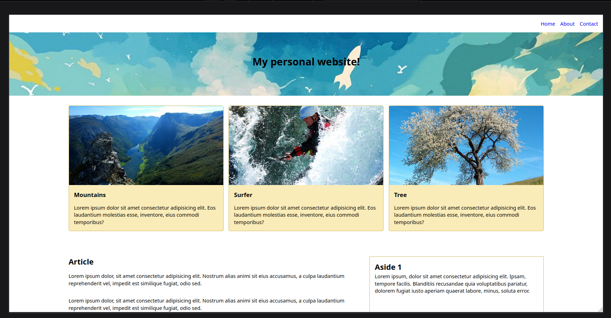
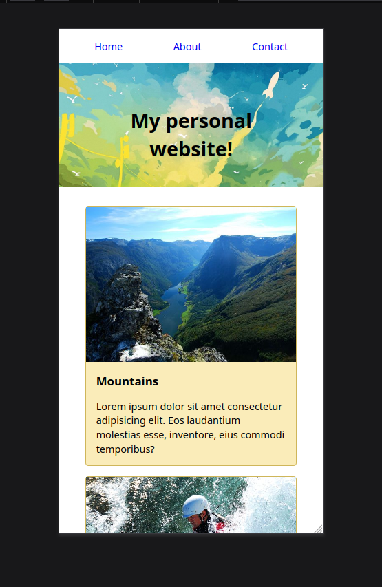

# Excerise SCSS

## About The Project
- Projekt um SCSS mithilfe von SASS anzuwenden
- responsive Design
- fiktiver Reise-Blog
  

(<a href="#readme-top">back to top</a>)

### Built With
HTML, SCSS, SASS, variables, mixins, media quieries

(<a href="#readme-top">back to top</a>)

### Screenshots

 
Desktop Version
 
 

 
Mobil Version

(<a href="#readme-top">back to top</a>)

<!-- ROADMAP -->
<!-- ## Roadmap

(<a href="#readme-top">back to top</a>)

-->

<!-- CONTACT -->
## Contact

Judith Bohmann
  
Mail: ju.bohmann@gmx.de
  
Repo-Link: <a href="https://github.com/You-Did-Bowman/Exercise-SCSS">github.com/You-Did-Bowman/Exercise-SCSS</a>
  
Homepage: <a href="https://you-did-bowman.github.io/Exercise-SCSS/">you-did-bowman.github.io/Exercise-SCSS/</a>

(<a href="#readme-top">back to top</a>)
